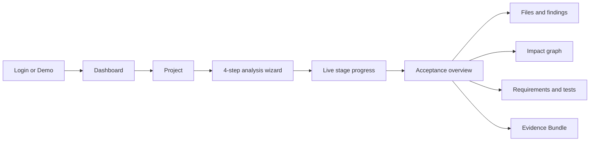
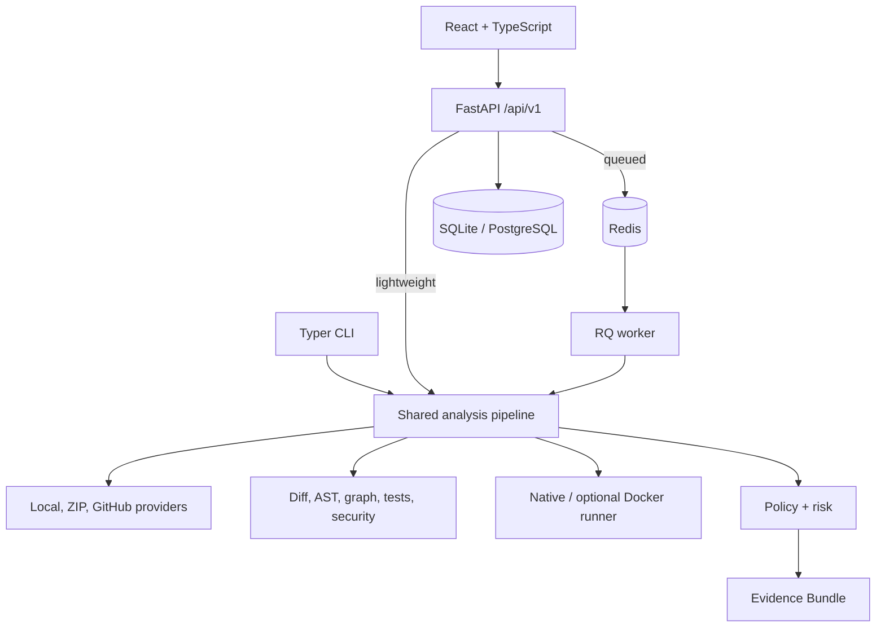

# ProofStack

> Evidence-driven acceptance for AI-generated code changes.

[Read this guide in Chinese · 中文说明](README.zh-CN.md)

AI coding tools can produce a patch in minutes. The hard part starts after that: proving the
patch meets the requirement, understanding its blast radius, finding missing tests, detecting
security and compatibility regressions, and leaving an audit trail a reviewer can trust.

ProofStack turns a repository change into structured acceptance evidence. It safely prepares
source, parses the real diff, maps requirements to code and tests, builds a Python impact
graph, scans security and configuration, runs bounded validation, evaluates an explainable
policy, and exports a checksummed Evidence Bundle. The deterministic path works offline and
requires no LLM key.

```text
 repository / ZIP / public GitHub PR / unified diff
                         │
                         ▼
   source → change → impact → tests → security → execution
                         │
                         ▼
             policy + explainable risk
                         │
                         ▼
             PASS / WARN / FAIL + evidence
```

## Why ProofStack

A green test command is valuable, but incomplete. It does not prove every acceptance
criterion is represented, that a changed public function has no downstream callers, that a
new environment variable is documented, or that a patch did not introduce a credential.
Conversely, a scanner finding is not enough to decide whether a change can merge.

ProofStack joins those signals into one review model:

- **Requirement evidence** links acceptance criteria to changed files, symbols, routes, and tests.
- **Impact evidence** exposes direct callers, imports, public signatures, API changes, and blast radius.
- **Test evidence** identifies related tests, gaps, missing integration coverage, and concrete test suggestions.
- **Security evidence** detects credential patterns, dangerous Python calls, and risky deployment configuration.
- **Execution evidence** records exact bounded commands and distinguishes passed, failed, skipped, unavailable, and timed out.
- **Decision evidence** explains every policy comparison and every risk component.
- **Audit evidence** records who initiated and reviewed important actions within the organization boundary.

## Highlights

- Real Git-style unified diff parsing: additions, modifications, deletion, rename metadata,
  hunks, line ranges, binary markers, and change classification.
- Python AST extraction for modules, imports, classes, sync/async functions, methods,
  decorators, signatures, calls, inheritance, exports, and cyclomatic complexity.
- Module and symbol graphs with changed-node and multi-hop blast-radius data for the web UI.
- FastAPI route, dependency manifest, environment, Docker, CI, and SQLAlchemy/Alembic impact checks.
- Offline requirement mapping and pytest-oriented test-gap analysis.
- Built-in secret and dangerous-pattern scanning; Semgrep is an optional adapter.
- Native allowlisted validation plus an optional resource-limited Docker runner.
- YAML policies with nine operators and explainable PASS/WARN/FAIL outcomes.
- Deterministic 0–100 risk scoring with named weighted components and severe-risk floors.
- Stable, redacted Evidence Bundles with SHA-256 verification and an offline HTML report.
- FastAPI, Redis/RQ worker, React/TypeScript web app, and Typer CLI sharing one analysis core.
- JWT access/refresh authentication, organization isolation, four RBAC roles, and audit logs.

## Product experience

The web app is a connected product surface, not a static dashboard. It includes authentication,
project management, a four-step analysis wizard, live stage progress, change and requirement
views, an interactive impact graph, finding triage, validation output, policy decisions,
Evidence download, audit history, and system settings.

Its visual language uses restrained orange, coral, and rose accents over translucent glass
surfaces. Light and dark themes keep status colors semantic, while balanced serif-led headings
and a tight type scale avoid oversized display text. Focus states, keyboard interaction,
responsive layouts, loading, empty, success, and error states are built in.



## Architecture



Package boundaries and design decisions are documented in the
[architecture overview](docs/architecture/overview.md) and
[domain model](docs/architecture/domain-model.md).

## Analysis pipeline

Every stage has the same observable contract, timing, normalized output, progress update, and
failure containment:

```text
PREPARE_SOURCE → PARSE_DIFF → DISCOVER_FILES → EXTRACT_SYMBOLS
→ BUILD_DEPENDENCY_GRAPH → MAP_REQUIREMENTS → ANALYZE_IMPACT
→ ANALYZE_TEST_GAPS → SCAN_SECURITY → SCAN_DEPENDENCIES
→ DETECT_CONFIG_CHANGES → EXECUTE_VALIDATION → EVALUATE_POLICIES
→ BUILD_EVIDENCE → FINALIZE
```

See [analysis pipeline details](docs/architecture/analysis-pipeline.md).

## Choose a way to run

| Mode | Needs Docker | Needs Redis/PostgreSQL | What it gives you |
| --- | --- | --- | --- |
| CLI Demo and local analysis | No | No | Full deterministic pipeline and Evidence Bundle |
| Local web | No | No | API + React UI, SQLite, inline background analysis |
| Full Compose | Yes | Yes, included | API, RQ worker, web, PostgreSQL, Redis |
| Docker validation runner | Yes | No for CLI | Extra isolation for explicitly enabled validation |

Docker is not required for the core product. Redis and PostgreSQL are only needed for the
multi-process queued deployment.

## Quick start

Prerequisites: Python 3.11+, Node.js 20+, and pnpm 9+. macOS and Linux are supported by the
provided scripts.

```bash
cp .env.example .env
make bootstrap
make db-upgrade
make dev
```

Open `http://localhost:5173`. The API is at `http://localhost:8000`, OpenAPI at
`http://localhost:8000/api/docs`, and SQLite data at `./proofstack.db`.

In development Demo mode, choose **Continue with Demo workspace**. The server creates a local
maintainer whose password is random and not exposed. No insecure production password exists.
Create a project and start **Demo repository** from the analysis wizard.

`make bootstrap` creates `.venv`, installs the Python project with development tools, enables
the recorded pnpm version through Corepack, and installs the frozen frontend workspace.

## Run the deterministic Demo

The checked-in Demo contains a baseline and a proposed FastAPI change. The proposed change
modifies a high-fan-in public signature, adds a route without tests, requires an undocumented
environment variable, adds a model field without a migration, broadens dependencies, invokes
`shell=True`, contains a synthetic token-shaped value, and weakens its Dockerfile.

It is analyzed every time; ProofStack does not return a prebuilt JSON result.

```bash
PROOFSTACK_DEMO_MODE=true proofstack demo --output ./proofstack-demo-evidence
proofstack report show ./proofstack-demo-evidence
proofstack evidence verify ./proofstack-demo-evidence
```

The output directory must be new. The Demo intentionally produces a **FAIL** verdict and
meaningful findings. Its current expected signals are documented in
[`expected-findings.md`](examples/demo-python-service/expected-findings.md).

## Local lightweight mode

The default `.env.example` selects SQLite, inline tasks, and native allowlisted validation.
Start everything with `make dev`, or use separate terminals:

```bash
make dev-api
make dev-web
```

Use `make dev-worker` only after setting `PROOFSTACK_TASK_BACKEND=rq` and starting a reachable
Redis. Inline mode is the easier first experience and still runs the complete analysis.

## Full Docker Compose mode

Compose includes Nginx-hosted web, API, RQ worker, PostgreSQL, and Redis. It does not mount the
Docker Socket, enable privileged mode, or enable the Docker analysis runner.

Generate URL-safe secrets, then start the stack:

```bash
export PROOFSTACK_POSTGRES_PASSWORD="$(python3 -c 'import secrets; print(secrets.token_urlsafe(24))')"
export PROOFSTACK_SECRET_KEY="$(python3 -c 'import secrets; print(secrets.token_urlsafe(48))')"
docker compose up --build
```

Open `http://localhost:8080`; the API is also exposed at `http://localhost:8000`. Production
defaults reject the development signing secret and disable Demo login. Register the first
organization owner through the UI.

For an explicit local-only Compose Demo, set these before starting:

```bash
export PROOFSTACK_ENV=development
export PROOFSTACK_DEMO_MODE=true
```

Do not use those two values for an internet-facing deployment. See
[sandboxing](docs/security/sandboxing.md) before enabling container validation.

## CLI

Install through `make bootstrap`, then explore `proofstack --help`.

```bash
proofstack version
proofstack doctor
proofstack demo --output ./demo-evidence
proofstack analyze path ./repository --requirements ./requirements.md
proofstack analyze diff ./change.patch --source ./repository --policy ./policy.yml
proofstack analyze github https://github.com/owner/repository/pull/123
proofstack policy validate ./policy.yml
proofstack report show ./evidence-bundle
proofstack evidence verify ./evidence-bundle.zip
proofstack server --host 127.0.0.1 --port 8000
```

Global flags come before the subcommand:

```bash
proofstack --json demo --output ./machine-readable-evidence
proofstack --quiet evidence verify ./evidence-bundle
```

Public GitHub analysis works without a token within upstream rate limits. Configure a narrowly
scoped read-only `PROOFSTACK_GITHUB_TOKEN` for higher limits. Never pass it on the command line.

## Web workflow

1. Register an organization or use Demo login in an explicit development environment.
2. Create a project with optional repository metadata.
3. Open **New analysis** and choose Demo, ZIP + optional diff, or public GitHub URL/PR.
4. Add Markdown requirements and acceptance criteria.
5. Select policy, runner, and bounded validation commands.
6. Review, submit, and follow real stage progress.
7. Inspect verdict, risk, files, graph, requirements, findings, validation, and policy evidence.
8. Triage findings according to role and download the verified Evidence Bundle.

## Understanding an analysis

### Verdict

- **PASS**: every evaluated policy rule passed.
- **WARN**: no blocking rule failed, but at least one advisory rule missed its threshold.
- **FAIL**: at least one blocking policy rule failed.
- **UNKNOWN**: evaluation has not completed or could not produce a trustworthy decision.

Completion and verdict are deliberately separate. A correctly executed analysis can complete
and return FAIL. Likewise, skipped or unavailable validation never becomes PASS.

### Risk score

Risk is an explainable prioritization score, not a probabilistic prediction. Twelve documented
components sum to 100: change surface (10), complexity/fan-in (8), API compatibility (10),
database (7), dependencies (6), security findings (20), secrets (12), test gap (8), requirement
gap (6), validation (8), configuration (3), and CI changes (2).

Critical findings apply a minimum score of 90, detected secrets 75, and three or more high
findings 70. The report includes every component, input, cap, floor, and explanation. Policy
still owns acceptance; risk never silently overrides it.

## Policies

```yaml
name: default
version: 1
rules:
  - id: no-critical-findings
    description: Critical findings are not allowed
    metric: findings.critical
    operator: eq
    value: 0
    outcome: fail

  - id: requirement-coverage
    description: Requirement evidence should reach 70 percent
    metric: requirements.coverage
    operator: gte
    value: 0.7
    outcome: warn
```

Operators: `eq`, `neq`, `gt`, `gte`, `lt`, `lte`, `in`, `not_in`, and `exists`. The runtime
exposes finding severity counts, validation counts, requirement coverage, and test evidence.
Start with [the examples](examples/sample-policies/README.md) and read the
[policy guide](docs/examples/policy-examples.md).

## Evidence Bundle

Every completed analysis can produce:

```text
manifest.json            summary.md              analysis.json
changed-files.json       requirements.json       dependency-graph.json
findings.json            test-results.json       policy-decisions.json
audit-events.json        checksums.sha256         report.html
```

Files have stable schema versions, every artifact is SHA-256 checksummed, and the HTML report
opens offline. Recursive redaction prevents configured credentials and full scanner matches
from entering the bundle. Verification checks schema, paths, symlinks, archive ratios,
required files, checksums, and credential exposure. Learn more in the
[Evidence Bundle guide](docs/examples/evidence-bundle.md).

## Configuration

| Variable | Local default | Purpose |
| --- | --- | --- |
| `PROOFSTACK_ENV` | `development` | `development`, `test`, or `production` security profile |
| `PROOFSTACK_DEMO_MODE` | `true` | Enables the local one-click Demo account and fixture |
| `PROOFSTACK_DATABASE_URL` | SQLite | SQLAlchemy SQLite or PostgreSQL URL |
| `PROOFSTACK_REDIS_URL` | local Redis URL | RQ connection |
| `PROOFSTACK_TASK_BACKEND` | `inline` | `inline` or `rq` |
| `PROOFSTACK_RUNNER` | `native` | Default validation runner |
| `PROOFSTACK_SECRET_KEY` | development-only value | JWT signing; must change in production |
| `PROOFSTACK_ACCESS_TOKEN_TTL` | `900` | Access token lifetime in seconds |
| `PROOFSTACK_REFRESH_TOKEN_TTL` | `604800` | Refresh token lifetime in seconds |
| `PROOFSTACK_MAX_UPLOAD_MB` | `25` | Upload limit |
| `PROOFSTACK_MAX_REPOSITORY_MB` | `100` | Prepared repository limit |
| `PROOFSTACK_MAX_FILE_COUNT` | `10000` | Prepared file-count limit |
| `PROOFSTACK_COMMAND_TIMEOUT` | `120` | Validation timeout in seconds |
| `PROOFSTACK_GITHUB_TOKEN` | unset | Optional read-only GitHub token |
| `PROOFSTACK_SEMGREP_ENABLED` | `false` | Optional Semgrep adapter |
| `PROOFSTACK_LLM_ENABLED` | `false` | Optional requirement-mapping enhancement |
| `PROOFSTACK_LLM_BASE_URL` | OpenAI-compatible URL | Optional provider base URL |
| `PROOFSTACK_LLM_API_KEY` | unset | Optional provider credential |
| `PROOFSTACK_LLM_MODEL` | unset | Optional model identifier |

Also available: `PROOFSTACK_ALLOWED_ORIGINS`, `PROOFSTACK_ARTIFACT_ROOT`,
`PROOFSTACK_WORKSPACE_ROOT`, and `PROOFSTACK_LOG_LEVEL`. Only `VITE_API_BASE_URL` is exposed to
the frontend build. See [.env.example](.env.example) and
[local development](docs/development/local-development.md).

## Security model

ProofStack treats repositories and uploads as untrusted data. ZIP extraction rejects traversal,
absolute paths, symlinks, special files, oversized members, excessive totals, file-count abuse,
and suspicious compression ratios. GitHub acquisition has URL, timeout, size, and file limits.
Logs, runner output, APIs, and evidence are bounded and redacted. Tenant access is scoped by
organization in server-side queries; RBAC is not delegated to the browser.

The native runner is **not a sandbox**. Even an allowlisted test interpreter can execute
repository code with your local user's permissions. Only run validation for code you trust,
or enable the Docker adapter after reviewing its residual risks. For adversarial authors, use
a disposable VM or dedicated sandbox service.

Read the [threat model](docs/security/threat-model.md),
[sandbox boundary](docs/security/sandboxing.md), and
[secret handling guide](docs/security/secret-handling.md).

## Development and testing

```bash
make help
make format
make lint
make typecheck
make test
make build
make smoke
make acceptance
make clean-check
```

`make acceptance` runs repository validation, Python and frontend format/lint/types, unit,
integration, contract, security and component tests, the frontend production build, CLI Demo, Evidence
verification, API smoke, final cleanup, and cleanliness verification. Playwright has three
offline end-to-end user journeys and is available through `make e2e`.

See [testing](docs/development/testing.md) and [contributing](CONTRIBUTING.md).

## Repository layout

```text
apps/                 FastAPI, RQ worker, Typer CLI, React web
packages/             core, analyzers, policies, providers, shared
migrations/           Alembic environment and versioned schema
tests/                unit, integration, contract, security, E2E support
examples/             real Demo snapshots, diffs, policies, sanitized reports
docs/                 architecture, API, development, security, examples
docker/               non-root API, worker, and web images plus Nginx
scripts/              acceptance, smoke, repository verification, cleanup
.github/workflows/    backend, frontend, security, E2E, acceptance CI
```

## Current limitations

- Deep static and impact analysis currently targets Python. Other languages receive file,
  diff, manifest, configuration, and generic evidence only.
- Requirement mapping is lexical and heuristic by default; it does not understand every
  domain phrase.
- Security checks are review aids, not a replacement for a full SAST, SCA, or penetration test.
- GitHub support targets public repositories and pull requests; private access depends on an
  explicitly configured read-only token.
- SQLite with inline work is a local convenience, not a horizontally scaled deployment.
- Container isolation reduces risk but is not equivalent to a VM security boundary.

## Roadmap

- Language adapters for TypeScript, Go, and Java built on the normalized graph contract.
- Durable per-stage retries and resumable workers.
- Signed Evidence Bundle attestations and object-storage adapters.
- OIDC/SSO and richer organization administration.
- Versioned community policy packs and baseline suppression workflows.
- Dedicated remote sandbox integration for hostile code execution.

## Contributing

Issues, focused analyzers, security hardening, documentation, and accessible product work are
welcome. Read [CONTRIBUTING.md](CONTRIBUTING.md) and the
[Code of Conduct](CODE_OF_CONDUCT.md). Please report vulnerabilities privately according to
[SECURITY.md](SECURITY.md).

## License

ProofStack is released under the [MIT License](LICENSE).
