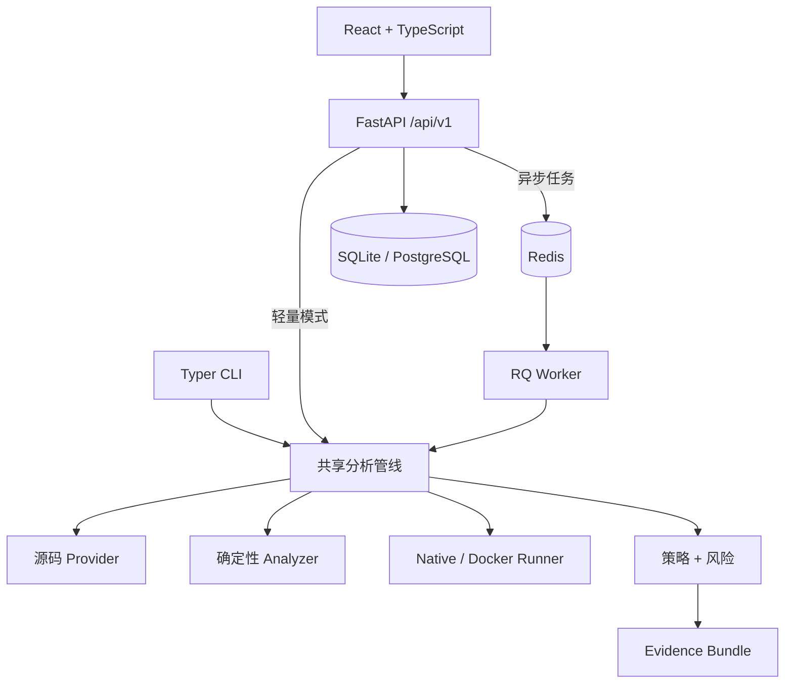

# ProofStack

> 面向 AI 生成代码变更的证据驱动验收平台。

[查看英文 README](README.md)

AI Coding 工具可以很快写出一个 Patch，但团队真正难的事情往往从这里才开始：
它是否完整实现了需求？公共函数改动会影响哪些调用方？新路由有没有测试？
是否引入了密钥、危险调用、依赖飘移或数据库兼容问题？当前证据到底够不够合并？

ProofStack 把一次代码变更转化为可审查、可解释、可校验的验收证据。它会安全准备源码、
解析真实 Unified Diff、将需求映射到代码和测试、构建 Python 影响图、扫描安全与配置风险、
执行有边界的验证命令，最后通过 YAML 策略输出 PASS / WARN / FAIL，并生成带 SHA-256 校验的
Evidence Bundle。

核心流程完全可以离线运行，不需要 LLM API Key。

```text
代码目录 / ZIP / GitHub 公开 PR / Unified Diff
                         │
                         ▼
    源码 → 变更 → 影响 → 测试 → 安全 → 执行
                         │
                         ▼
                 策略 + 可解释风险
                         │
                         ▼
               PASS / WARN / FAIL + 证据
```

## ProofStack 解决什么

一条通过的测试命令很有价值，但它无法单独证明每条验收条件都已落地；无法告诉你一个高扇入
公共函数的变更会波及多少模块；也不会自动发现新增环境变量没有更新 `.env.example`。
同样，单个扫描器的 Finding 也不足以替团队做出合并决策。

ProofStack 把这些信号放到同一个验收模型中：

- **需求证据**：把 Acceptance Criteria 与变更文件、Symbol、API 路由和测试建立关联。
- **影响证据**：展示调用者、Import、签名变化、API 兼容性以及多跳 Blast Radius。
- **测试证据**：定位关联测试、缺口、缺失的集成测试，并输出可审核的测试建议。
- **安全证据**：检测密钥模式、Python 危险调用、Docker / Compose / CI 风险。
- **执行证据**：记录受限命令与真实状态，严格区分 passed、failed、skipped、unavailable 和 timed out。
- **决策证据**：解释每条策略观测值、期望值、结果，以及风险分的每个组成部分。
- **审计证据**：记录分析发起、Finding 状态修改、项目删除等重要行为。

## 核心亮点

- 真实解析 Git 风格 Unified Diff：新增、修改、删除、重命名信息、Hunk、行范围和二进制标记。
- 基于 Python AST 提取 Module、Import、Class、同步/异步 Function、Decorator、Signature、Call、Inheritance 和复杂度。
- 构建 Module Graph、Symbol Graph、Changed Symbol Graph 和多跳影响范围，为前端提供真实图数据。
- 识别 FastAPI 路由、依赖清单、环境变量、Docker、CI 和 SQLAlchemy/Alembic 变更。
- 默认使用离线确定性需求映射与 pytest 为主的 Test Gap 分析。
- 内置 Secret Scanner 和危险模式扫描；Semgrep 是可选 Adapter。
- 提供 Native 白名单 Runner，以及默认禁网、限 CPU/内存/PID 的可选 Docker Runner。
- YAML 策略支持 9 种运算符，结果可解释。
- 0–100 确定性风险评分，具备显式权重、分项上限和严重风险下限。
- Evidence Bundle 具备稳定 Schema、递归脱敏、SHA-256 校验和离线 HTML 报告。
- FastAPI、Redis/RQ Worker、React + TypeScript Web 和 Typer CLI 共用同一套核心管线。
- Access/Refresh Token、组织数据隔离、四级 RBAC 和 Audit Log。

## 产品界面

Web 端不是几张静态卡片，而是与真实 API 连通的完整工作台：登录/注册、项目管理、
四步分析向导、阶段进度、变更文件、交互式影响图、需求证据、Finding 处置、执行结果、策略决策、
Evidence 下载、审计日志和系统设置都是可用流程。

视觉使用克制的橙、珊瑚红与粉玫瑰渐变点缀，搭配半透明玻璃拟态界面；支持深浅主题。标题使用
现代 Serif 字体栈，字号层级有节制，不会用极端大字破坏信息密度。界面同时提供键盘焦点、响应式布局，
以及 loading / empty / error / success 状态。

## 系统架构



详见[架构概览](docs/architecture/overview.md)、
[领域模型](docs/architecture/domain-model.md)和
[扩展机制](docs/architecture/plugin-system.md)。

## 分析流程

```text
PREPARE_SOURCE → PARSE_DIFF → DISCOVER_FILES → EXTRACT_SYMBOLS
→ BUILD_DEPENDENCY_GRAPH → MAP_REQUIREMENTS → ANALYZE_IMPACT
→ ANALYZE_TEST_GAPS → SCAN_SECURITY → SCAN_DEPENDENCIES
→ DETECT_CONFIG_CHANGES → EXECUTE_VALIDATION → EVALUATE_POLICIES
→ BUILD_EVIDENCE → FINALIZE
```

每个 Stage 都使用统一接口，记录开始/结束时间、状态、进度和标准化输出，错误会被隔离并转换为
用户可理解的信息。详见[分析管线](docs/architecture/analysis-pipeline.md)。

## 运行方式对比

| 模式 | 需要 Docker | 需要 Redis/PostgreSQL | 适用场景 |
| --- | --- | --- | --- |
| CLI Demo / 本地分析 | 否 | 否 | 离线审查、CI、Evidence Bundle |
| 本地 Web 轻量模式 | 否 | 否 | SQLite + Inline Task 的完整 UI |
| Docker Compose | 是 | 是，Compose 已包含 | API + Worker + Web 多进程部署 |
| Docker 验证 Runner | 是 | CLI 时不需要 | 显式启用的额外隔离 |

核心功能不强制依赖 Docker。Redis 和 PostgreSQL 只是多进程异步部署所需。

## 快速开始

需要 Python 3.11+、Node.js 20+ 和 pnpm 9+。脚本支持 macOS 和 Linux。

```bash
cp .env.example .env
make bootstrap
make db-upgrade
make dev
```

打开 `http://localhost:5173`。API 地址是 `http://localhost:8000`，OpenAPI 文档在
`http://localhost:8000/api/docs`，默认数据库是 `./proofstack.db`。

开发 Demo 模式下，点击 **Continue with Demo workspace** 即可进入。后端会创建一个本地 Maintainer，
密码由安全随机数生成且不会暴露；项目不存在不安全的生产默认密码。

## 运行真实 Demo

Demo 内含 `base` 和 `changed` 两份 FastAPI 源码快照、真实 Diff、需求文档和策略。变更特意包含
高扇入公共函数签名变化、新路由测试缺失、未文档化环境变量、模型字段无迁移、宽泛依赖、
`shell=True`、合成 Token 形状字符串和不安全 Dockerfile。

```bash
PROOFSTACK_DEMO_MODE=true proofstack demo --output ./proofstack-demo-evidence
proofstack report show ./proofstack-demo-evidence
proofstack evidence verify ./proofstack-demo-evidence
```

输出目录必须事先不存在。Demo 每次都真实走完管线，不会直接返回预生成 JSON。它预期给出
**FAIL**，主要信号见 [`expected-findings.md`](examples/demo-python-service/expected-findings.md)。

## 本地轻量模式

`.env.example` 默认使用 SQLite、Inline Task 和 Native 白名单验证。`make dev` 可同时启动前后端，
也可以分别运行：

```bash
make dev-api
make dev-web
```

只有在已设置 `PROOFSTACK_TASK_BACKEND=rq` 并启动 Redis 时才需要 `make dev-worker`。Inline 模式仍然会
运行完整分析，它只是不需要独立 Worker。

## Docker Compose 完整模式

Compose 包含 Nginx Web、API、RQ Worker、PostgreSQL 和 Redis。默认不挂载 Docker Socket，不使用
privileged，也不开启 Docker 分析 Runner。

```bash
export PROOFSTACK_POSTGRES_PASSWORD="$(python3 -c 'import secrets; print(secrets.token_urlsafe(24))')"
export PROOFSTACK_SECRET_KEY="$(python3 -c 'import secrets; print(secrets.token_urlsafe(48))')"
docker compose up --build
```

打开 `http://localhost:8080`，API 同时暴露在 `http://localhost:8000`。生产默认会拒绝开发签名密钥，
并禁用 Demo 登录，请从 UI 注册第一个组织 Owner。

如果只在本机使用 Compose 体验 Demo，可在启动前显式设置：

```bash
export PROOFSTACK_ENV=development
export PROOFSTACK_DEMO_MODE=true
```

不要将这两个值用在公网生产环境。开启容器验证前请先阅读
[沙箱安全边界](docs/security/sandboxing.md)。

## CLI

```bash
proofstack version
proofstack doctor
proofstack demo --output ./demo-evidence
proofstack analyze path ./repository --requirements ./requirements.md
proofstack analyze diff ./change.patch --source ./repository --policy ./policy.yml
proofstack analyze github https://github.com/owner/repository/pull/123
proofstack policy validate ./policy.yml
proofstack report show ./evidence-bundle
proofstack evidence verify ./evidence-bundle.zip
proofstack server --host 127.0.0.1 --port 8000
```

全局选项需放在子命令之前：

```bash
proofstack --json demo --output ./machine-readable-evidence
proofstack --quiet evidence verify ./evidence-bundle
```

公开 GitHub 仓库在无 Token 时也可分析，但受上游 Rate Limit 影响。需要提高限额时，请用最小权限、
只读的 `PROOFSTACK_GITHUB_TOKEN`，不要把 Token 写在命令行中。

## Web 使用流程

1. 注册一个组织，或者在显式的开发环境使用 Demo 登录。
2. 创建 Project，可选填写仓库信息。
3. 进入 New Analysis，选择 Demo、ZIP + Diff 或 GitHub URL/PR。
4. 填写 Markdown 需求与 Acceptance Criteria。
5. 选择 Policy、Runner 与受限验证命令。
6. 确认并发起分析，查看真实 Stage 进度。
7. 审查 Verdict、Risk、Files、Graph、Requirements、Findings、Validation 和 Policy。
8. 根据角色权限处置 Finding，并下载 Evidence Bundle。

## 如何理解结果

### Verdict

- **PASS**：所有被评估策略规则都已通过。
- **WARN**：没有阻断规则失败，但存在未达标的建议性规则。
- **FAIL**：至少一条阻断规则失败。
- **UNKNOWN**：尚未完成策略评估，或无法得到可信决策。

分析状态与 Verdict 是两件事。管线正常 completed 后返回 FAIL，是正确而不是异常。skipped 或
unavailable 的验证也绝不会被包装成 passed。

### Risk Score

风险分是确定性的审查优先级，不是黑箱概率。12 个组成部分合计 100 分：变更面 10、复杂度/扇入 8、
API 兼容 10、数据库 7、依赖 6、安全 Finding 20、Secret 12、测试缺口 8、需求缺口 6、验证失败 8、
配置 3、CI 变更 2。

Critical Finding 会将风险下限提到 90，检测到 Secret 时下限为 75，3 个及以上 High Finding 时下限为
70。报告会输出所有输入、分项、上限、下限和解释。最终验收仍由 Policy 决定，Risk 不会暗中覆盖 Policy。

## 策略

```yaml
name: default
version: 1
rules:
  - id: no-critical-findings
    description: Critical findings are not allowed
    metric: findings.critical
    operator: eq
    value: 0
    outcome: fail

  - id: requirement-coverage
    description: Requirement evidence should reach 70 percent
    metric: requirements.coverage
    operator: gte
    value: 0.7
    outcome: warn
```

支持 `eq`、`neq`、`gt`、`gte`、`lt`、`lte`、`in`、`not_in` 和 `exists`。管线向策略暴露
Finding 严重度计数、Validation 计数、Requirement Coverage 和 Test Evidence Score。可从
[示例策略](examples/sample-policies/README.md)和[策略指南](docs/examples/policy-examples.md)开始。

## Evidence Bundle

```text
manifest.json            summary.md              analysis.json
changed-files.json       requirements.json       dependency-graph.json
findings.json            test-results.json       policy-decisions.json
audit-events.json        checksums.sha256         report.html
```

JSON 具备稳定 Schema Version，每个文件都有 SHA-256，HTML 报告可离线打开。递归脱敏会阻止已配置凭据和
完整 Secret 进入 Bundle。校验器会检查 Schema、安全路径、符号链接、压缩比、必需文件、Checksum 和凭据暴露。

详见 [Evidence Bundle 指南](docs/examples/evidence-bundle.md)。

## 配置

| 变量 | 本地默认值 | 作用 |
| --- | --- | --- |
| `PROOFSTACK_ENV` | `development` | `development` / `test` / `production` 安全配置 |
| `PROOFSTACK_DEMO_MODE` | `true` | 开启本地一键 Demo |
| `PROOFSTACK_DATABASE_URL` | SQLite | SQLite 或 PostgreSQL URL |
| `PROOFSTACK_REDIS_URL` | 本地 Redis | RQ 连接 |
| `PROOFSTACK_TASK_BACKEND` | `inline` | `inline` 或 `rq` |
| `PROOFSTACK_RUNNER` | `native` | 默认验证 Runner |
| `PROOFSTACK_SECRET_KEY` | 仅开发 | JWT 签名，生产必须替换 |
| `PROOFSTACK_ACCESS_TOKEN_TTL` | `900` | Access Token 秒数 |
| `PROOFSTACK_REFRESH_TOKEN_TTL` | `604800` | Refresh Token 秒数 |
| `PROOFSTACK_MAX_UPLOAD_MB` | `25` | 上传大小上限 |
| `PROOFSTACK_MAX_REPOSITORY_MB` | `100` | 准备后仓库上限 |
| `PROOFSTACK_MAX_FILE_COUNT` | `10000` | 文件数上限 |
| `PROOFSTACK_COMMAND_TIMEOUT` | `120` | 验证命令超时秒数 |
| `PROOFSTACK_GITHUB_TOKEN` | 未设置 | 可选只读 GitHub Token |
| `PROOFSTACK_SEMGREP_ENABLED` | `false` | 可选 Semgrep Adapter |
| `PROOFSTACK_LLM_ENABLED` | `false` | 可选需求映射增强 |
| `PROOFSTACK_LLM_BASE_URL` | OpenAI-Compatible URL | 可选 Provider URL |
| `PROOFSTACK_LLM_API_KEY` | 未设置 | 可选 Provider 凭据 |
| `PROOFSTACK_LLM_MODEL` | 未设置 | 可选模型名 |

还支持 `PROOFSTACK_ALLOWED_ORIGINS`、`PROOFSTACK_ARTIFACT_ROOT`、`PROOFSTACK_WORKSPACE_ROOT` 和
`PROOFSTACK_LOG_LEVEL`。前端只能获取安全的 `VITE_API_BASE_URL`。详见 [.env.example](.env.example)。

## 安全边界

ProofStack 默认将仓库、ZIP、Diff、需求和命令输出都视为不可信数据。ZIP 解压会拒绝路径穿越、
绝对路径、符号链接、特殊文件、超大成员、超限总量、文件数滥用和可疑压缩比。GitHub 获取也具备
URL、Timeout、仓库大小和文件数限制。日志、Runner 输出、API 与 Evidence 都有长度限制和脱敏。

**Native Runner 不是操作系统沙箱。** 即使命令在白名单中，测试解释器仍可以以当前用户权限执行仓库代码。
只对你愿意在本机直接运行的代码启用 Native Validation。对恶意作者，应使用一次性 VM 或专用沙箱服务。

请阅读[威胁模型](docs/security/threat-model.md)、
[沙箱边界](docs/security/sandboxing.md)与
[密钥处理](docs/security/secret-handling.md)。

## 开发与测试

```bash
make help
make format
make lint
make typecheck
make test
make build
make smoke
make acceptance
make clean-check
```

`make acceptance` 会按顺序运行仓库结构检查、Python 和前端 Format/Lint/Typecheck、Unit/Integration/Contract/
Security/组件测试、前端生产构建、CLI Demo、Evidence 校验、API Smoke，最后完成清理与 Clean Check。
Playwright 提供 3 条不依赖外网的 E2E 用户流程，可通过 `make e2e` 运行。

GitHub 仅保留一个 CI 工作流，在向 `main` 提交代码或创建 PR 时运行后端和前端的格式、Lint、类型、
测试及前端构建。安全回归测试包含在后端测试中。CI 没有定时任务、在线依赖审计、Semgrep 服务请求、
报告上传或自动部署。安装依赖仍会从 PyPI 和 npm 下载软件包。
需要额外验证时，可在本地手动运行 `make smoke`、`make acceptance` 和 `make e2e`。

更多信息见[本地开发](docs/development/local-development.md)、
[测试指南](docs/development/testing.md)和 [CONTRIBUTING.md](CONTRIBUTING.md)。

## 仓库结构

```text
apps/                 FastAPI、RQ Worker、Typer CLI、React Web
packages/             core、analyzers、policies、providers、shared
migrations/           Alembic 配置与版本化 Schema
tests/                unit、integration、contract、security、E2E 支持
examples/             真实 Demo 快照、Diff、Policy、脱敏报告
docs/                 架构、API、开发、安全和示例文档
docker/               非 root API、Worker、Web 镜像与 Nginx
scripts/              Acceptance、Smoke、仓库校验与清理
.github/workflows/    一个后端和前端 CI 工作流
```

## 当前限制

- 深度静态分析和影响分析目前聚焦 Python；其他语言目前只有文件、Diff、Manifest 和通用配置证据。
- 默认需求映射是词法与规则启发式，无法完整理解所有业务语义。
- 安全扫描是代码审查辅助，不替代全量 SAST、SCA 或渗透测试。
- GitHub 聚焦公开仓库和 PR；私有访问需要显式配置只读 Token。
- SQLite + Inline 是本地便捷模式，不是水平扩展部署。
- 容器隔离可以降低风险，但不等同于 VM 级别的安全边界。

## Roadmap

- 基于统一 Graph Contract 的 TypeScript、Go 和 Java 语言 Adapter。
- Stage 级持久化重试和可恢复 Worker。
- Evidence Bundle 签名证明与对象存储 Adapter。
- OIDC/SSO 和更完整的组织管理。
- 版本化社区 Policy Pack 和 Baseline/Suppression 工作流。
- 面向敌对代码的远程专用沙箱。

## 参与贡献

欢迎提交问题、Analyzer、安全加固、文档和无障碍产品改进。请先阅读
[CONTRIBUTING.md](CONTRIBUTING.md) 和[行为准则](CODE_OF_CONDUCT.md)。安全漏洞请按
[SECURITY.md](SECURITY.md) 私下报告，不要公开泄露细节。

## License

ProofStack 基于 [MIT License](LICENSE) 开源。
