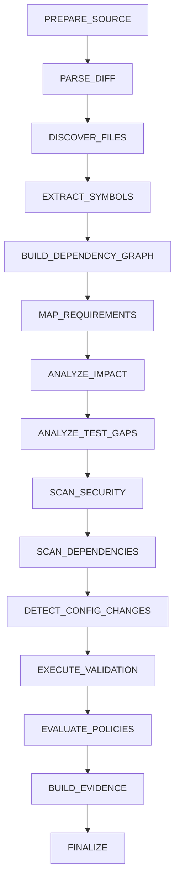

# Analysis pipeline

An analysis is a sequence of small stages implementing the shared `AnalysisStage` contract.
Each stage receives `AnalysisContext`, returns a `StageResult`, records timing and findings,
and exposes a user-readable failure when it cannot complete.

## Data flow

Source preparation returns a safe local root and optional diff. Demo mode selects the
checked-in `changed` snapshot and separately reads the `base` snapshot for compatibility
comparison. ZIP and GitHub providers enforce size, count, path, timeout, and cleanup limits.

Discovery reads bounded text files and ignores VCS metadata, dependencies, build output,
binary content, large files, and symlinks. The diff, Python AST, import and call graph,
FastAPI routes, requirements, tests, secrets, dangerous patterns, dependency manifests,
configuration, and database models then produce normalized evidence.

Validation uses a fixed command allowlist and argument arrays. Its stdout and stderr are
bounded and redacted. Policy evaluation consumes severity counts, validation counts,
requirement coverage, and test evidence. Risk scoring is deterministic and produces named
components. Evidence generation writes stable JSON, Markdown, HTML, and checksums before the
analysis is finalized.

## Failure and cancellation

The orchestrator captures stage exceptions into a failed `StageResult`; it does not expose a
server stack to the caller. Progress callbacks persist stage transitions. Cancellation is
checked between stages, producing a distinct cancelled result. Prepared temporary sources
are cleaned in a `finally` path for local and worker executions.

This model allows a future stage retry without making the analysis result ambiguous: inputs,
stage outcome, and artifacts remain explicit.
