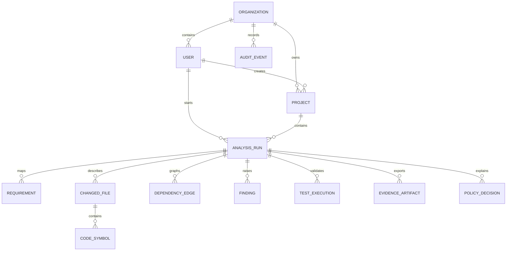

# Domain model

All persistent resources belong to an organization, either directly or through a project.
Repository queries always include the caller's organization boundary. Identifiers are
opaque strings; possession of an identifier never grants access.

## Aggregate roots

`Organization` is the tenancy and authorization boundary. Users have one of four ordered
roles: owner, maintainer, reviewer, or viewer. Owners manage organization membership;
maintainers manage projects and analyses; reviewers may update finding disposition; viewers
have read-only access.

`Project` groups source metadata and analysis history. Deleting a project intentionally
cascades to its analysis-owned records. The delete action itself is written to the
organization audit stream before the transaction removes the project.

`AnalysisRun` is a durable state machine. Its status moves through queued, preparation,
analysis, testing, evaluation, and one terminal state. `verdict` is separate from execution
status: a successfully completed analysis may correctly return a failing acceptance verdict.

## Evidence records

- `Requirement` stores the normalized user story and acceptance criteria.
- `ChangedFile`, `CodeSymbol`, and `DependencyEdge` describe the change and blast radius.
- `Finding` is a deduplicated, fingerprinted observation with category, severity, location,
  remediation, evidence, and review status.
- `TestExecution` preserves status accurately: skipped and unavailable are never passed.
- `PolicyDecision` stores the observed and expected values behind every rule outcome.
- `EvidenceArtifact` records content type, storage path, size, and SHA-256.
- `AuditEvent` records actor, action, resource, metadata, origin, and timestamp.

JSON columns contain structured evidence without database-specific operators, preserving
SQLite and PostgreSQL compatibility. Indexed ownership, status, severity, and timestamp
columns support the primary list and filtering paths.
