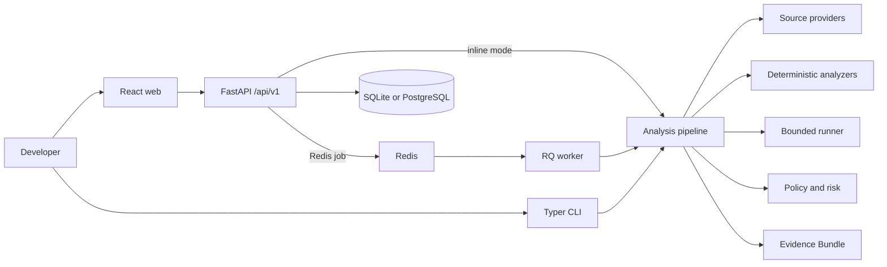

# Architecture overview

ProofStack is a monorepo with one deterministic analysis domain and four delivery surfaces:
the FastAPI service, an RQ worker, a Typer CLI, and a React application. The API and CLI do
not reimplement analysis; both call the same staged pipeline and adapters.

## Runtime profiles

| Profile | Database | Task dispatch | Validation | Best for |
| --- | --- | --- | --- | --- |
| Local lightweight | SQLite | FastAPI background task | Native allowlist | First run, demos, development |
| CLI | None required | In-process | Native allowlist | Local review and CI steps |
| Compose | PostgreSQL | Redis and RQ | Native by default | Multi-process team deployment |
| Hardened validation | Either | Either | Optional Docker sandbox | Explicitly reviewed untrusted execution |

The system is useful without an LLM, GitHub token, Semgrep, Redis, PostgreSQL, or Docker.
Those integrations are adapters, never hidden prerequisites for deterministic analysis.

## Boundary rules

- `packages/core` owns pipeline contracts, domain analysis records, and evidence primitives.
- `packages/analyzers` owns parsing and deterministic evidence extraction.
- `packages/providers` owns source and execution adapters.
- `packages/policies` owns YAML policy evaluation and explainable risk scoring.
- `packages/shared` owns configuration, shared enums, redaction, and version data.
- `apps/*` contains transport and process concerns only.

See [the pipeline](analysis-pipeline.md), [domain model](domain-model.md), and
[extension model](plugin-system.md) for the detailed contracts.
